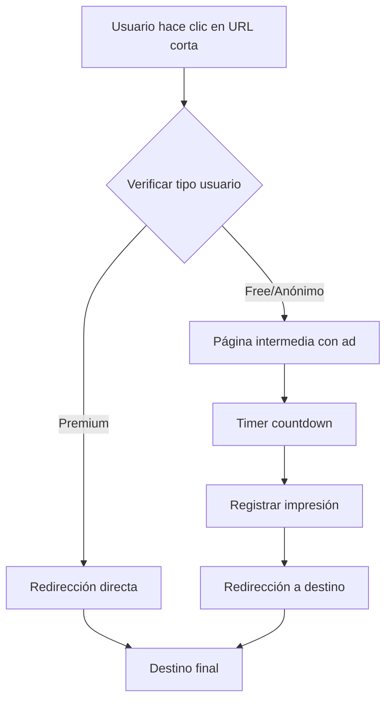

# Sistema de Publicidad y Monetización - Roadmap

**Propuesto:** 7 de Julio, 2025  
**Estado:** ⏳ Planificado - No desarrollado  
**Prioridad:** Alta (Fase 5)  
**Estimación:** 2-3 semanas

---

## 📋 Concepto de la Funcionalidad

### 🎯 Objetivo Principal
Implementar un **sistema de publicidad intermedia** que muestre anuncios a usuarios free y anónimos antes de redireccionar a la URL final, generando ingresos adicionales por impresiones.

### 💡 Explicación del Flujo
1. **Usuario hace clic** en una URL corta de SNR.red
2. **Sistema verifica** el tipo de usuario:
   - 🟡 **Premium** → Redirección directa (sin anuncios)
   - 🔵 **Free/Anónimo** → Página intermedia con publicidad
3. **Página intermedia** muestra:
   - Banner publicitario
   - Countdown timer (5-10 segundos configurable)
   - Mensaje tipo "Redirigiendo en X segundos..."
   - Botón "Skip Ad" (habilitado después del timer)
   - Opción "Upgrade to Premium" para evitar futuros anuncios
4. **Después del timer** → Redirección automática a destino final
5. **Métricas registradas**: Impresiones, clics, tiempo de visualización

### 🎯 Características Clave
- **Para usuarios free/anónimos**: Página intermedia obligatoria con publicidad
- **Para usuarios premium**: Redirección directa sin interrupciones
- **Monetización**: Ingresos por impresiones y clics publicitarios
- **Incentivo premium**: Experiencia libre de anuncios como beneficio
- **Configuración admin**: Control total sobre duración, targeting y contenido
- **Analytics**: Métricas detalladas de performance publicitaria

---

## 🏗️ Arquitectura Técnica Propuesta

### 🔀 Flujo de Redirección Modificado


### 🗄️ Nuevos Modelos de Datos
```typescript
// Modelo de Anuncio
interface Ad {
  id: string;
  title: string;
  imageUrl: string;        // Banner publicitario
  targetUrl: string;       // URL del anunciante
  isActive: boolean;
  displayDuration: number; // Segundos de espera
  impressions: number;     // Visualizaciones
  clicks: number;          // Clics en el anuncio
  budget?: number;         // Presupuesto opcional
  startDate: Date;
  endDate?: Date;
  targeting?: {
    countries?: string[];
    userTypes?: ('anonymous' | 'free')[];
    deviceTypes?: ('mobile' | 'desktop')[];
  };
}

// Registro de Impresión
interface AdImpression {
  id: string;
  adId: string;
  urlId: string;           // URL corta que generó la impresión
  userType: 'anonymous' | 'free';
  deviceType: 'mobile' | 'desktop';
  country?: string;
  timestamp: Date;
  duration: number;        // Tiempo que vio el anuncio
  clicked: boolean;        // Si hizo clic en el anuncio
  skipped: boolean;        // Si saltó el anuncio
}
```

### 🔧 Nuevos Endpoints API
```bash
# Gestión de Anuncios (Admin)
POST   /api/admin/ads              # Crear anuncio
GET    /api/admin/ads              # Listar anuncios
PUT    /api/admin/ads/:id          # Editar anuncio
DELETE /api/admin/ads/:id          # Eliminar anuncio
GET    /api/admin/ads/analytics    # Métricas publicitarias

# Redirección con Publicidad
GET    /api/redirect/:shortCode    # Nueva ruta de redirección
POST   /api/ads/impression        # Registrar impresión
POST   /api/ads/click             # Registrar clic en anuncio

# Obtener Anuncio para Mostrar
GET    /api/ads/display/:shortCode # Obtener anuncio a mostrar
```

---

## 🎨 Diseño de UI Propuesto

### 📱 Página Intermedia (`/redirect/[shortCode]`)
```tsx
// Estructura visual propuesta
<div className="min-h-screen bg-gradient-to-br from-blue-50 to-purple-50">
  {/* Header con logo SNR.red */}
  <Header />
  
  {/* Contenido principal */}
  <main className="flex flex-col items-center justify-center flex-1 px-4">
    
    {/* Información de redirección */}
    <Card className="max-w-md w-full mb-6">
      <CardContent className="text-center p-6">
        <h2>Redirigiendo...</h2>
        <p>Serás redirigido a tu destino en:</p>
        <div className="text-4xl font-bold text-blue-600 my-4">
          {countdown}s
        </div>
        <p className="text-sm text-gray-500">
          {destinationUrl}
        </p>
      </CardContent>
    </Card>

    {/* Banner publicitario */}
    <Card className="max-w-lg w-full">
      <CardContent className="p-4">
        <div className="text-xs text-gray-400 mb-2">Publicidad</div>
        <AdBanner ad={currentAd} />
      </CardContent>
    </Card>

    {/* Botón skip (habilitado después del timer) */}
    <Button 
      disabled={countdown > 0}
      onClick={skipAd}
      className="mt-4"
    >
      {countdown > 0 ? `Espera ${countdown}s` : 'Continuar →'}
    </Button>

  </main>
  
  {/* Footer con info de premium */}
  <Footer>
    <p>¿Cansado de anuncios? 
      <Link href="/premium">Upgrade a Premium</Link> 
      para redirecciones instantáneas
    </p>
  </Footer>
</div>
```

### 🛠️ Panel de Administración
- **Sección nueva en admin**: "Gestión de Publicidad"
- **Lista de anuncios** con métricas básicas
- **Editor de anuncios** con preview
- **Dashboard de analytics** publicitarios
- **Configuración global** (tiempo de espera, bypass premium, etc.)

---

## 💰 Modelo de Monetización

### 📊 Métricas Clave
- **CPM (Costo por Mil impresiones)**: $1-5 USD típico
- **CTR esperado**: 1-3% para anuncios relevantes  
- **Impresiones diarias estimadas**: Depende del tráfico
- **Revenue potencial**: CPM × (Impresiones/1000)

### 🎯 Targeting Básico
- **Por tipo de usuario**: Solo free/anónimos
- **Por dispositivo**: Mobile vs Desktop
- **Por geolocalización**: Países específicos
- **Por hora**: Horarios de mayor tráfico

### 🔄 Optimización
- **A/B testing** de diferentes duraciones de timer
- **Rotación de anuncios** para maximizar CTR  
- **Análisis de rendimiento** por anuncio
- **Ajuste automático** de frecuencia según feedback

---

## ⚙️ Configuración Técnica

### 🌐 Variables de Entorno
```env
# Configuración de Publicidad
ENABLE_ADS=true
AD_DISPLAY_DURATION=7          # Segundos por defecto
AD_BYPASS_PREMIUM=true         # Saltar ads para premium
AD_MIN_DURATION=3              # Mínimo configurable
AD_MAX_DURATION=15             # Máximo configurable

# Integración externa (futuro)
GOOGLE_ADSENSE_CLIENT_ID=ca-pub-xxxxx
FACEBOOK_PIXEL_ID=xxxxx

# Analytics
AD_ANALYTICS_ENABLED=true
AD_CLICK_TRACKING=true
```

### 🔧 Configuración Admin
```typescript
interface AdConfig {
  enabled: boolean;
  defaultDuration: number;      // Segundos
  premiumBypass: boolean;
  allowSkip: boolean;
  trackClicks: boolean;
  trackImpressions: boolean;
  maxAdsPerDay: number;         // Por usuario
  cooldownBetweenAds: number;   // Minutos
}
```

---

## 🚀 Plan de Implementación

### 📅 Fases de Desarrollo (2-3 semanas)

#### **Semana 1: Backend y Core Logic**
- [ ] Crear modelos `Ad` y `AdImpression`
- [ ] Implementar `adService` y `redirectService`
- [ ] Crear endpoints de redirección con lógica de usuario
- [ ] Implementar sistema de selección de anuncios
- [ ] Agregar middleware de tracking

#### **Semana 2: Frontend y UI**
- [ ] Crear página `/redirect/[shortCode]`
- [ ] Implementar componente `AdDisplay`
- [ ] Crear timer y lógica de countdown
- [ ] Implementar panel admin para gestión de ads
- [ ] Responsive design y optimización móvil

#### **Semana 3: Analytics y Optimización**  
- [ ] Dashboard de métricas publicitarias
- [ ] Sistema de reportes y exportación
- [ ] A/B testing framework básico
- [ ] Optimizaciones de rendimiento
- [ ] Testing integral y deployment

### 🧪 Testing Required
- [ ] **Unit tests**: Lógica de redirección y timing
- [ ] **Integration tests**: Flujo completo de ads
- [ ] **E2E tests**: Experiencia de usuario real
- [ ] **Performance tests**: Carga de páginas intermedias
- [ ] **A/B tests**: Diferentes duraciones de timer

---

## 🎯 Métricas de Éxito

### 📈 KPIs del Sistema de Publicidad
```yaml
Revenue_Metrics:
  - monthly_ad_revenue: ">$100 primer mes"
  - cpm_rate: ">$2.00 promedio"  
  - impressions_per_day: ">500 después de 1 mes"

User_Experience:
  - bounce_rate_ad_page: "<15%"
  - premium_conversion_from_ads: ">2%"
  - user_complaints: "<5% usuarios"

Technical_Performance:
  - ad_page_load_time: "<2 seconds"
  - redirect_success_rate: ">99%"
  - ad_serving_uptime: ">99.9%"
```

### 🎨 Experiencia de Usuario
- **Balance cuidadoso**: Monetización sin afectar UX negativamente
- **Valor premium claro**: Incentivo real para upgrade  
- **Transparencia**: Usuario entiende por qué ve anuncios
- **Control**: Opción de skip después del timer

---

## 🔮 Futuras Expansiones

### 🌟 V2 Features (Futuro)
- [ ] **Integración Google AdSense**: Anuncios automáticos
- [ ] **Anuncios nativos**: Mejor integración visual
- [ ] **Targeting avanzado**: Basado en comportamiento
- [ ] **Programmatic ads**: Subastas automáticas
- [ ] **Video ads**: Anuncios en video cortos
- [ ] **Retargeting**: Anuncios personalizados

### 📊 Analytics Avanzados
- [ ] **ML-powered optimization**: Algoritmos de optimización
- [ ] **Heatmaps**: Análisis visual de interacción
- [ ] **Cohort analysis**: Comportamiento por grupos de usuarios
- [ ] **Attribution modeling**: Impacto en conversiones

---

**Estado:** ⏳ **PLANIFICADO - PENDIENTE DE DESARROLLO**  
**Próxima revisión:** Cuando se priorice para implementación  
**Dependencias:** Sistema de usuarios premium funcionando correctamente  
**Valor esperado:** 💰 **Alto potencial de monetización**
